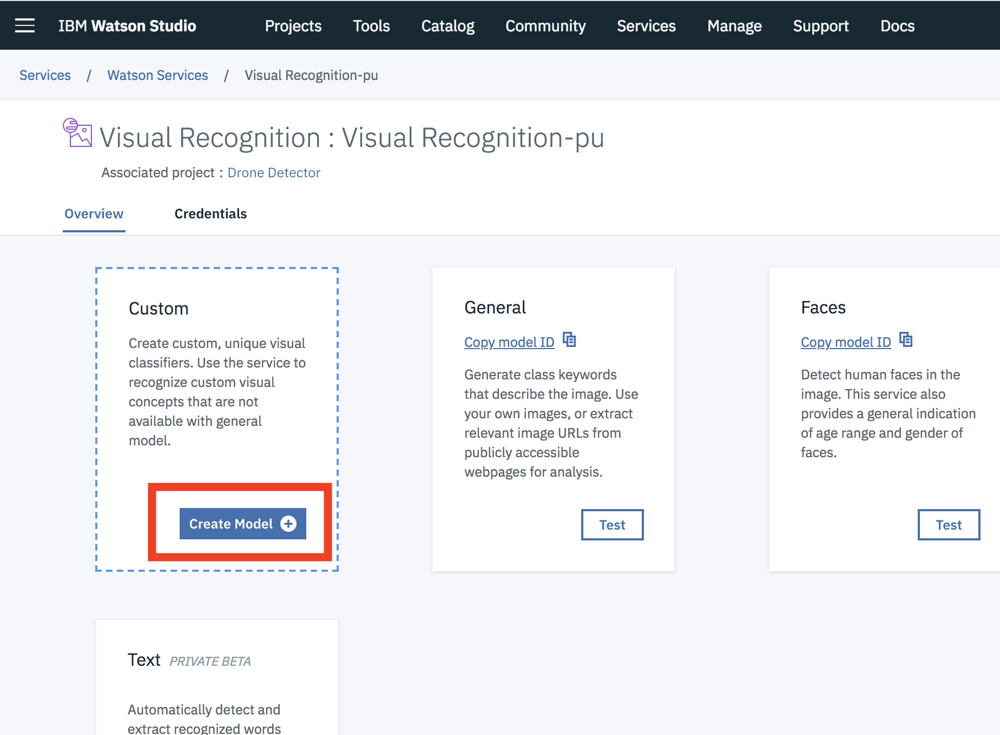
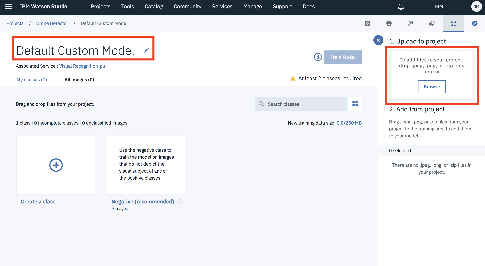
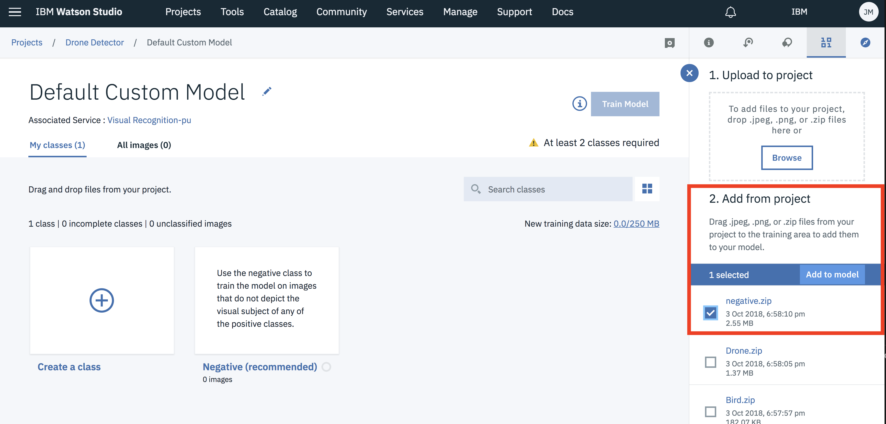
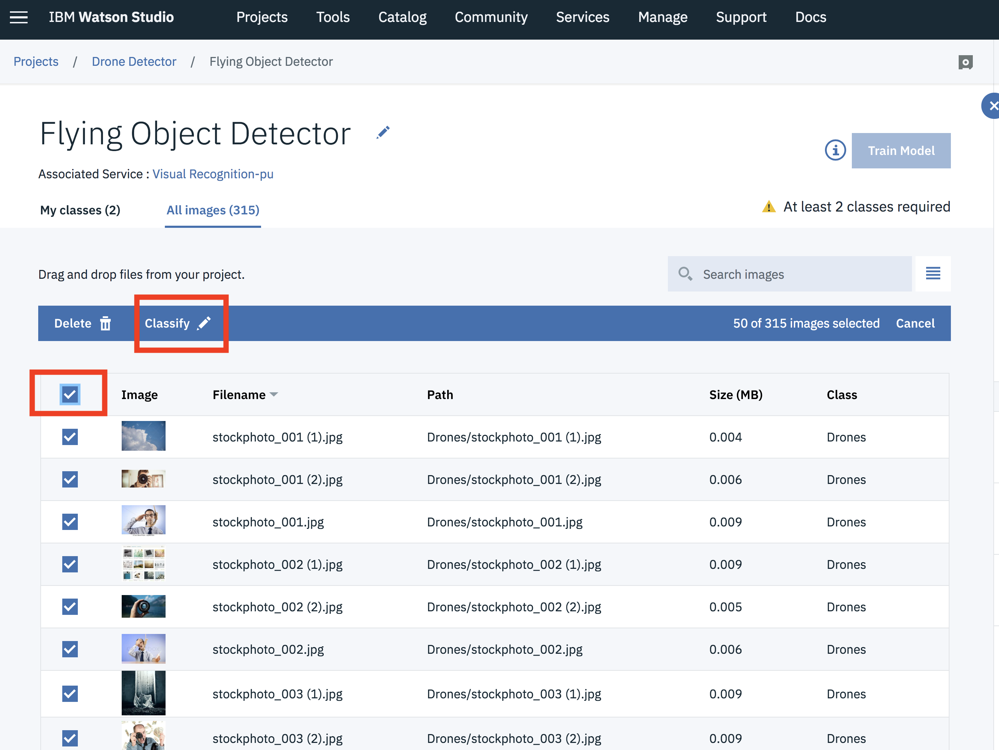
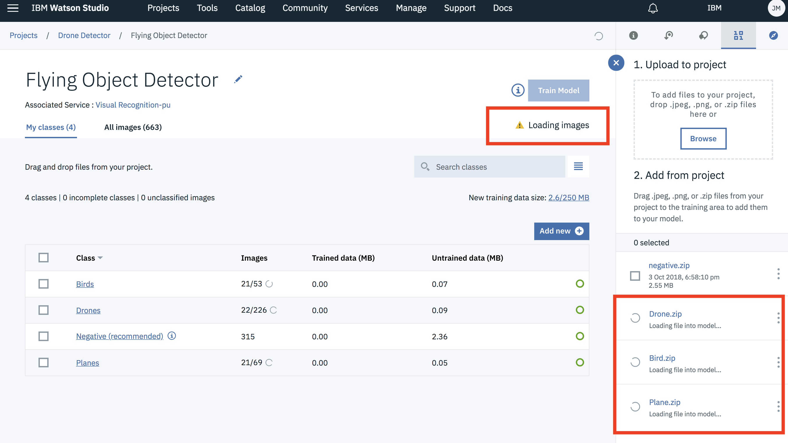
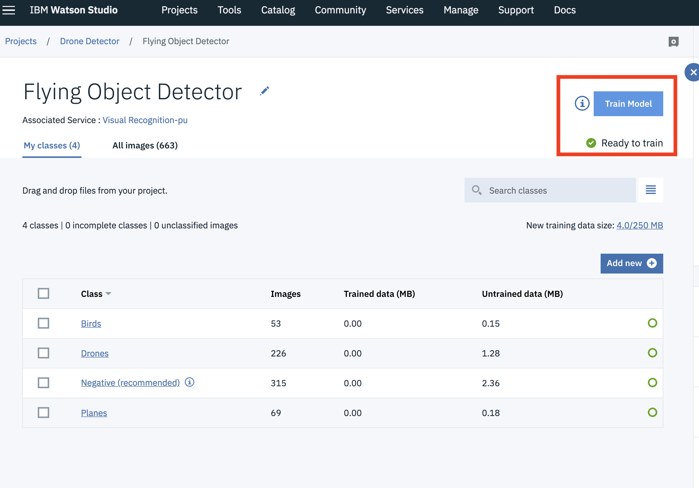

# Building Drone Detector Visual Recognition Models

## Overview
When building a visual recognition model there are several considerations around model access. Are you expecting users of the model to have access to the internet, or will they have intermittent connectivity, will they run on an iOS device, or within a container on a Raspberry Pi; each usecase requires different levels of understanding and different tools for deployment. 

In this example we're going to create and deploy two types of machine learning models
    1. Deployment as a Web Service, requiring access to the internet to make a preiction
    2. Deployment within a container, for execution on an ARM architecture device, as a API


## Tools
There are several tools available for training and deployment, each with strengths and drawbacks. 
    1. Watson Visual Recognition
    2. PowerAI and Juypter Notebooks

## Data
When training the models to recognize drones, two sets of data was used.
    1. 4 Classigication categories

    ``` 
        Drone       [drone.zip](https://ibm.box.com/shared/static/791dk2hzl9cw1ibl0ov43kvkhqq268ys.zip)
        Bird        [bird.zip](https://ibm.box.com/shared/static/pd4xfya67le03flczwrpbgut1imk4quc.zip)
        Plane       [plane.zip](https://ibm.box.com/shared/static/fjforuepnopbuyl8bov9w85ifhrk5w1t.zip)
        Negative    [negative.zip](https://ibm.box.com/shared/static/squt4108edtnfzkohlw3fgz7ladmklvg.zip)
    ```

    2. Binary Drone or not Drone classifier:  [drone_data.tar](https://ibm.box.com/shared/static/63z8hr199bcw4wt5k577v9zh0ttxuvqf.tar)
        ```
        test_set/
            drone/
            notdrone/
        training_set
            drone/
            notdrone/
        validation_set
            drone/
            notdrone/
        ```

## 1. Watson Visual Recognition
Watson Visual Recognition has a Web Based tool in addition to an API for training, accessing, and deploying visual recognition models as a websiervice or locally as a coreML file for execution on iOS. 

1. Create the Watson Visual Recognition Service
2. Upload the data and train a model
3. Invoke the trained model through HTTP POST call

### 1. Create the Watson Visual Recognition Service
Create a Watson Visual Recognition Service
https://console.bluemix.net/catalog/services/visual-recognition

### 2. Upload the data an train a model

Create a new Custom Model:


Rename the custom model, upload data


Import the negative examples


Reclassify images ensuring Negative are classified as Negative


Import the drone, bird, and plane training sets to watson visual recognition.


Train the model


### 3. Invoke the trained model through HTTP POST call

```curl -u "apikey:{apikey}" "https://gateway.watsonplatform.net/visual-recognition/api/v3/classify?url=https://watson-developer-cloud.github.io/doc-tutorial-downloads/visual-recognition/fruitbowl.jpg&version=2018-03-19&classifier_ids=FlyingObjectDetector_1150910815"```

Replace the {apikey} with your API key for Watson Visual Recognition


Replace the url= with a link to the image you want to classify.


## 2. PowerAI and Juypter Notebooks

